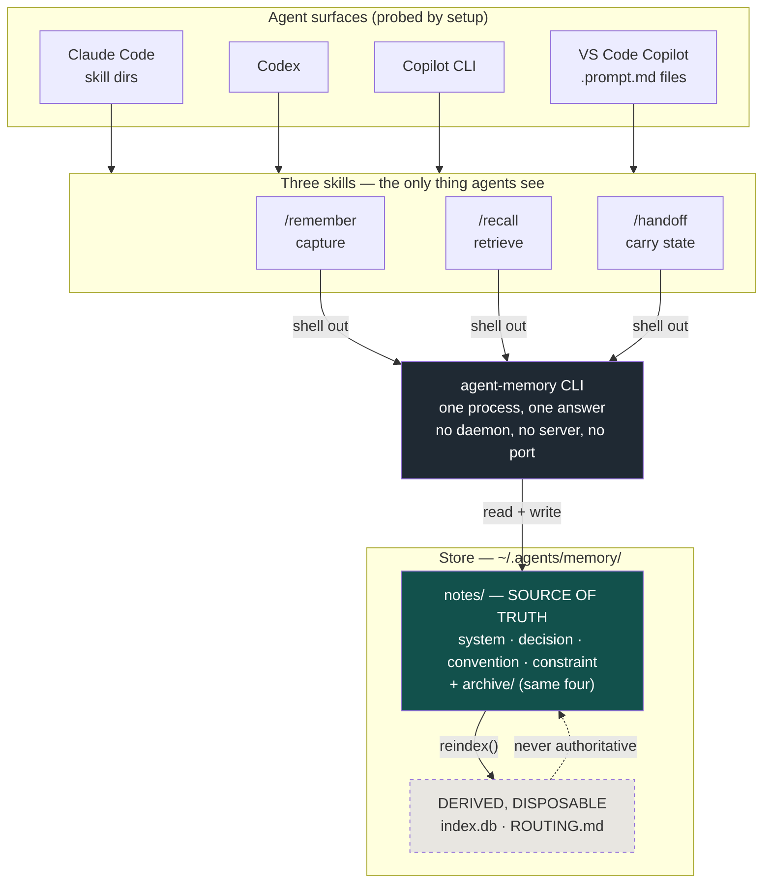
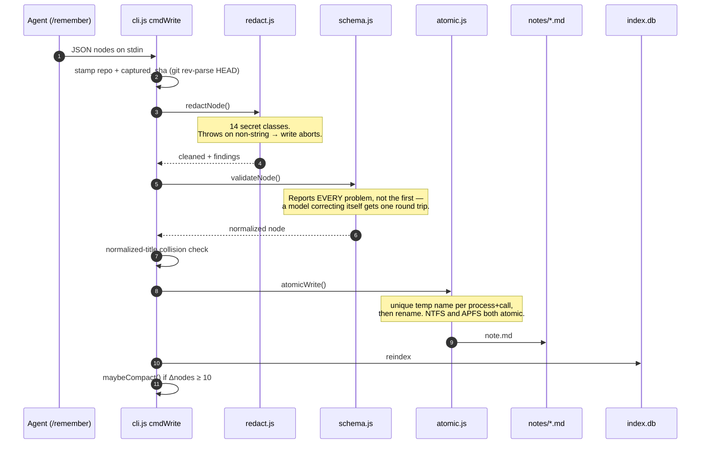
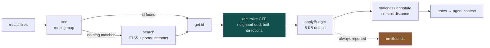
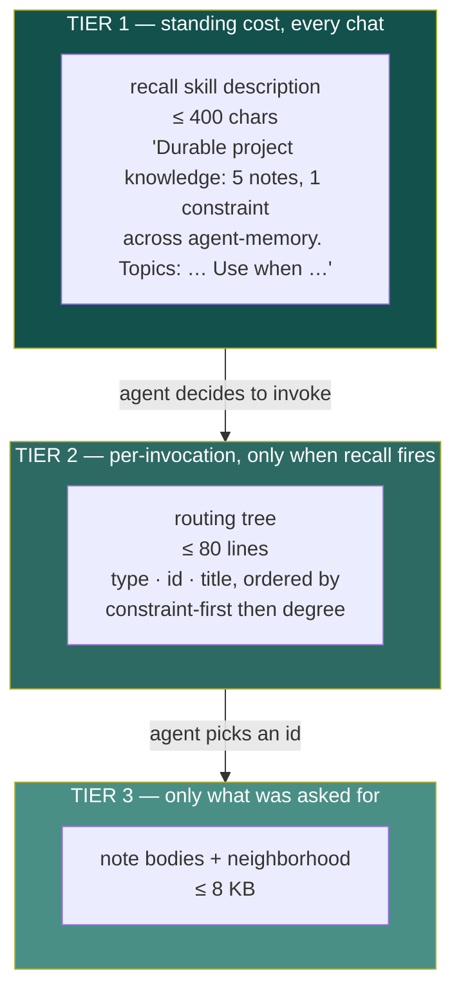
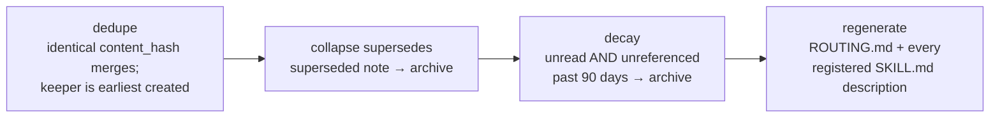
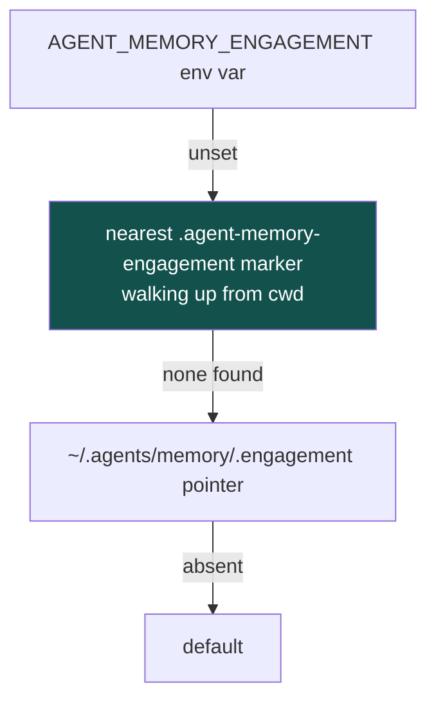

# Architecture

How agent-memory is built, and why it is built that way.

Every figure here was read from the source rather than written from memory, at the
commit that introduced this document: 15 modules, 3,443 lines of JavaScript, zero
runtime dependencies and zero dev dependencies, 91 tests.

---

## The one idea

Everything else follows from a single decision:

> **Markdown notes are the source of truth. The SQLite index is a cache that can be
> deleted at any time.**

The test that keeps this honest is stated in `src/index-db.js` and enforced in the
suite: delete `index.db`, run `agent-memory index`, and every query must return
identical output. Nothing in `src/store.js` is allowed to import the database.

This is not a stylistic preference. It is what makes the tool survivable on a
locked-down corporate desktop:

- A note is a file a human can read, diff, grep, fix in a text editor, or restore from
  a backup with no tooling at all.
- Corruption is recoverable by deletion rather than by migration.
- A security reviewer can read the entire store without running anything.
- There is no schema migration story, because a cache does not need one. A version
  mismatch drops the tables and rebuilds from the markdown.

---

## System shape



The dashed box is the whole architecture in one glyph: it can be thrown away.

---

## On disk

```
~/.agents/memory/                     # AGENT_MEMORY_HOME, or USERPROFILE/.agents/memory
├── notes/                            # ← SOURCE OF TRUTH
│   ├── system/          *.md         #   how something works
│   ├── decision/        *.md         #   why a choice was made
│   ├── convention/      *.md         #   what pattern applies
│   ├── constraint/      *.md         #   what the environment forbids
│   └── archive/
│       ├── system/  decision/  convention/  constraint/
├── index.db                          # ← derived. safe to delete.
├── ROUTING.md                        # ← derived. regenerated by compact.
├── config.json                       # per-store caps
├── .engagement                       # pointer to the active engagement
└── .gitignore                        # contains "*" — memory stays local by default
```

A note is YAML-subset frontmatter plus a markdown body:

```markdown
---
id: fail-closed-redaction
type: convention
title: "Redaction runs inside the write path, never at the call site"
scope: repo
confidence: observed
source: manual
created: "2026-08-07T21:21:06Z"
updated: "2026-08-07T21:21:06Z"
accessed: "2026-08-07T21:21:06Z"
captured_sha: 5d288b0082f2e0b4303f5f4db26ea33af357a6b8
supersedes: null
repos: [agent-memory]
edges:
  - rel: applies-to
    dst: memory-store-layout
---

src/store.js:writeNote redacts before validation and before any byte reaches disk...
```

The frontmatter parser is hand-rolled (`src/store.js`, ~75 lines) against a
deliberately small YAML subset. That is a direct trade: a YAML library would be more
general, but "zero runtime dependencies" is the most useful single sentence to be able
to say in a security review, and this store never needs general YAML.

**`archived` is not a field.** It is derived from which directory the file sits in.
Archiving is a `rename()`. That means it survives losing the index, and it is
reversible by hand with a file manager. Nothing is ever deleted — a note the operator
stopped reading is not a note the operator wanted destroyed.

### The four types

| Type | Answers | Privileged? |
|---|---|---|
| `system` | How does this work? | no |
| `decision` | Why was this chosen? | no |
| `convention` | What pattern applies here? | no |
| `constraint` | What does the environment forbid? | **yes** |

`constraint` is exempt from every truncation path in the system — the retrieval
budget, the routing tree cap, and the digest. The reasoning is economic: a constraint
is what stops an agent from burning a dozen premium requests on an approach the org
forbids. Dropping one to save bytes trades the cheap thing away for the expensive one.

---

## The write path



**Order is the security property.** Redaction runs before validation and before any
byte reaches disk — before a temp file even exists. No caller can bypass it, because
it lives inside `writeNote()` rather than at the call sites. And it fails closed: a
scan that throws aborts the write rather than letting unscanned bytes through.

Fourteen secret classes are matched at capture: `anthropic-key`, `assigned-secret`,
`aws-access-key`, `bearer-token`, `connection-string`, `github-token`,
`google-api-key`, `internal-host`, `jwt`, `openai-key`, `private-ip`, `private-key`,
`session-cookie`, `slack-token`. Findings are replaced with `<redacted:kind>`.

---

## The read path



### The graph engine is one query

There is no adjacency cache, no in-memory graph, no second traversal in JavaScript.
`src/graph.js` is 99 lines, and the traversal is a single prepared statement:

```sql
WITH RECURSIVE hood(id, depth) AS (
  SELECT ?, 0
  UNION                                    -- not UNION ALL: collapses repeat visits
  SELECT CASE WHEN e.src = h.id THEN e.dst ELSE e.src END, h.depth + 1
    FROM edges e
    JOIN hood h ON e.src = h.id OR e.dst = h.id
   WHERE h.depth < ?                       -- depth bound terminates recursion
)
SELECT n.*, MIN(hood.depth) AS depth, (...) AS degree
  FROM nodes n JOIN hood ON n.id = hood.id
 GROUP BY n.id
 ORDER BY depth, n.type, n.id
```

Both guards are load-bearing. `contradicts` edges make cycles inevitable, and a cycle
without `UNION` *and* a depth bound would recurse until SQLite gave up.

Edges are followed in **both directions**. A note that depends on the auth service is
part of the auth service's neighborhood, and someone asking about auth wants to hear
about it. Five relations exist: `depends-on`, `applies-to`, `supersedes`,
`contradicts`, `evidence-for`.

### The budget

`get --depth 2` on a well-connected node can return fifty notes and blow the context
this whole design exists to protect. `applyBudget()` prunes **deepest first, then
least connected** — depth is distance from what was asked about, and low degree means
the node is unlikely to be the hub anyone needed.

Two things are never dropped: the root, and any `constraint`.

**Omitted ids are always returned.** Silent truncation that reads as full coverage is
the single most dangerous thing this tool could do, because it looks like an answer.
The same rule governs the routing tree, which prints `N nodes not shown` rather than
quietly ending.

---

## Two-tier routing

The expensive resource is not disk or CPU. It is the model's context window, and the
premium request budget behind it.



Tier 1 is loaded into every chat whether or not memory is ever used, so it has to read
like a description rather than a document. It is composed from constraint count, then
repos by note count, then topics by edge degree — and on overflow it sheds the
lowest-degree topics first, then repos, **one whole item at a time**. Cutting mid-word
would leave the description looking corrupted, which is worse than saying less.

Two pieces are structural and never dropped: the constraint count, and the closing
"use when" clause — which is the entire reason an agent decides to invoke at all.

Neither tier costs a premium request. A request is charged per prompt, not per tool
call, so both ride inside a turn that was already paid for.

---

## Maintenance: `compact`

**Compaction is pure code. No model is involved, and none should be.** Everything here
is a rule an operator can predict and check by hand. Because it needs no model, it
never needs a schedule and never costs a premium request.



Edges pointing at an absorbed id are repointed at the keeper, so a merge never leaves
a dangling reference. `compact` runs automatically when the node count moves by 10.

The regeneration step is why `/recall`'s description in your installed skills stays
accurate as the store grows — the skill file is rewritten in place, and the machine
config records which `SKILL.md` files to update.

---

## Trust signals

A `system` note claiming "auth uses JWT" after the code moved to sessions is worse
than no memory at all, because it misleads with confidence. Two deterministic signals
address this — no model, no scheduled job, just a commit count.

**Staleness** (`src/staleness.js`): every note about a repo carries `captured_sha`.
At read time, git counts commits since. At **≥ 10** commits the note is annotated
inline with `captured N commits ago — verify before trusting`. At **≥ 100**, `doctor`
flags it for deliberate review. A rewritten history reports `history rewritten,
verify` rather than a number.

The annotation appears at the exact moment the note is being used, which is the only
moment anyone can act on it.

**Capture gap** — the inverse signal. If a repo has moved **≥ 50** commits and nothing
was captured at all, the routing map says so. A short list with a silent footer reads
as full coverage; this is where a thin graph has to admit that it is thin.

---

## Engagement isolation

A consultant runs several clients through one machine, and knowledge from one is not
the next one's to see.

The boundary is **a separate store directory per engagement**, not a column to filter
on. Filtering has to be remembered at every read, and there are fourteen of them — two
were already missed. A separate directory cannot be forgotten, and purging one is a
directory removal that can be shown to have happened.

Resolution order, decided once per process:



The marker file is what makes this survive real use: drop one at the root of a client's
tree and every repository beneath it is in that engagement, with nothing to remember
when switching windows.

One subtlety, learned by getting it wrong: **machine-scoped keys live outside every
engagement.** Where the skills are installed is a fact about the machine, not about the
client. Registering `skillPaths` per engagement meant `compact` had nothing to
regenerate after a switch, and the recall description kept advertising the previous
engagement's topics — into the agent's context, which is the worst possible place for
it. Caps like `digestChars` really are per-store, and stay there.

---

## Disclosure control: two layers that must not merge

| | `src/redact.js` | `src/pii.js` |
|---|---|---|
| **Runs at** | capture | export |
| **Asks** | "could this authenticate as someone?" | "could this identify a person?" |
| **Threat** | a credential reaching disk | a human reading the file |
| **Operator's own email** | **preserved** | **removed** |
| **Marker** | `<redacted:kind>` | `[redacted:kind]` |
| **On failure** | throws, aborting the write | throws, withholding the note |

The operator's own email is the clearest case of the difference: safe to store, because
it is already public in every commit they have ever pushed — but not theirs to hand to
someone else alongside a hundred notes about how their client works.

Export detects five structured identifiers with **validators, not just patterns**:
`email`, `ssn` (area/group/serial rules), `payment-card` (Luhn + length 13–19),
`phone` (10–15 digits, rejects repeated digits and date shapes), and `ip-address`
(rejects reserved and private ranges, which are infrastructure and already stripped at
capture).

Detector order is load-bearing: a grouped card number is also a valid phone shape, so
cards are consumed before phones get a chance.

A note is **withheld entirely** — not redacted inline — above 8 findings or a 30%
density ratio, on the theory that a note that dense in identifiers is *about* a person.
Every export prints a receipt saying what was removed and what was held back.

Measured against an adversarial corpus in `test/pii.eval.test.js`: recall 1.0 by kind,
precision 1.0 across 15 negatives, and three known gaps (person name, postal address,
bare internal identifier) asserted **as gaps** rather than quietly hoped away.

---

## Distribution and install

`agent-memory` ships **no install hooks**. Version 0.4.0 deleted
`scripts/postinstall.js` outright; `package.json` declares only `test` and `setup`.

That was a direct response to a public supply-chain scanner flagging the package
Critical under a policy named `ai_agent_control_hijack` — *"install code writes
project/home/global agent-control files without explicit user action."* The scanner's
own published remediation was to move setup into an explicit user command, which is
what `agent-memory setup` now is. The behavior was removed rather than argued with.

`setup` probes for agent surfaces and installs only where a tool is actually present,
then reports what it found and what it skipped. Nothing is guessed — a path appears in
`src/targets.js` only when the mechanism is documented or observed.

Two formats are written from one source:

- **Agent skills** — directories containing `SKILL.md`, linked into place.
- **VS Code prompt files** — single `<name>.prompt.md` files, generated from the same
  `SKILL.md` at install time.

The prompt file is derived rather than hand-maintained, because two copies of the same
procedure drift, and the one nobody is looking at is the one that goes stale.

---

## Concurrency

Two VS Code windows open at once is the normal working mode, not an exotic case. Three
mechanisms handle it, all in the "boring and correct" category:

1. **Atomic writes.** The temp name is unique per process *and* per call. A fixed
   `<target>.tmp` looks atomic and is not: two processes collide on that one path, A
   writes tmp, B overwrites tmp, A renames and publishes B's bytes, then B renames and
   fails `ENOENT`.
2. **`PRAGMA busy_timeout = 5000` first.** Set before every other pragma, because until
   it is set they fail instantly on `SQLITE_BUSY` rather than waiting.
3. **WAL journaling.** A reader in one window proceeds while another window writes. It
   is a persistent property of the file, so losing the race to set it is harmless.

---

## Invariants

The properties that must stay true. Each is covered by the test suite.

1. Delete `index.db`, run `agent-memory index`, get identical query output.
2. Nothing reaches disk unscanned; a scan that throws aborts the write.
3. Nothing is ever deleted. Archiving is a rename into `notes/archive/`.
4. One process, one answer — no daemon, no server, no port, no scheduled job.
5. Truncation is never silent. Omitted ids are always reported.
6. Zero runtime dependencies, zero dev dependencies.
7. `constraint` notes are exempt from every truncation path.
8. All three version manifests agree (`package.json`, `plugin.json`,
   `marketplace.json`) — guarded by a test, because nothing else synced them and one
   drifted 15 releases behind.

---

## Module map

| Module | Lines | Responsibility |
|---|--:|---|
| `cli.js` | 957 | 13 commands; one process, one answer |
| `index-db.js` | 317 | SQLite cache: DDL, reindex, FTS5 search |
| `pii.js` | 274 | export-time disclosure control |
| `store.js` | 256 | notes as source of truth; frontmatter; atomic upsert |
| `compact.js` | 242 | dedupe, supersede, decay, regenerate |
| `setup.js` | 222 | install into detected agent surfaces |
| `staleness.js` | 213 | commit-distance staleness and capture gap |
| `digest.js` | 202 | two-tier routing: description + tree |
| `config.js` | 191 | engagement resolution; two-file config split |
| `targets.js` | 140 | where each agent looks for instructions |
| `graph.js` | 99 | recursive CTE traversal + retrieval budget |
| `schema.js` | 98 | validate and normalize; reports every problem |
| `redact.js` | 97 | capture-time fail-closed secret redaction |
| `promptfile.js` | 78 | VS Code prompt files derived from SKILL.md |
| `atomic.js` | 57 | atomic write; imports nothing from this package |
| **total** | **3,443** | zero dependencies, 91 tests |

`atomic.js` deliberately imports nothing from the package: `store.js` already imports
`config.js`, so putting the atomic write in either would create a cycle.

---

## What this does not do

Stated plainly, because a memory tool that overclaims is worse than one that does less.

- **No semantic search.** Retrieval is FTS5 with a porter stemmer, plus a graph
  traversal. There are no embeddings and no vector store. The stemmer is what lets
  "secrets" find "secret" — the mismatch natural questions actually produce.
- **No automatic capture.** A note exists because an agent decided a juncture passed
  and wrote it. The `/remember` skill is instructed to fire unasked at such junctures,
  but nothing scrapes conversations wholesale.
- **No conflict resolution across machines.** `export` and `import` carry knowledge
  between machines with provenance intact; they do not merge divergent histories.
- **No server.** Nothing listens on a port. Nothing runs between invocations.
